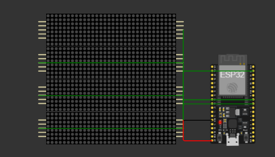

# Project Silver Helm

A wearable Daft Punk–inspired LED helmet featuring a programmable scrolling visor, RGB lighting, and wireless control.

---

## Overview

Project Silver Helm is a wearable embedded systems project designed as part of the **Hack Club Fallout program**. It combines electronics, firmware, and 3D design into a fully integrated helmet system.

The helmet includes:

* A scrolling LED matrix visor for dynamic text display
* Addressable RGB lighting for visual effects
* Bluetooth control via smartphone
* A modular internal electronics system

This project focuses on real-world system design, integrating hardware, software, and physical structure into a cohesive product.

---

## Why I Made This

for fun lol

yet I wanted to build something that creative

The Daft Punk helmet design is a perfect platform for this and also cz i like daft punk

This project also pushes me beyond just coding into full product design.

---

## Features

* 📟 Scrolling LED visor (MAX7219 matrices)
* 🌈 WS2812B addressable RGB lighting
* 📱 Bluetooth control from smartphone
* 🔌 Portable USB-powered system
* 🧩 Modular architecture for easier testing and upgrades

---

## How It Works

The system is built around an ESP32 microcontroller.

### Inputs

* Bluetooth commands from a smartphone

### Processing

* ESP32 interprets commands and controls outputs

### Outputs

* LED matrix visor (text display)
* RGB LEDs (lighting effects)

### Example Commands

```
TEXT: HELLO
BRIGHT: 5
MODE: SCROLL
```

---

## Hardware Design

### Microcontroller

* ESP32

Chosen over Arduino Nano 33 BLE Rev2 due to:

* Higher processing power
* Built-in Bluetooth
* Lower cost

### Components

* MAX7219 LED Matrix Modules (visor display)
* USB battery pack (power supply)

---

## 3D Model & Structure

The helmet shell is based on an existing open-source model:

[https://www.thingiverse.com/thing:5033571](https://www.thingiverse.com/thing:5033571)

This model includes:

* Full helmet structure
* LED mounting support
* Visor integration

I chose to use this model to focus more on electronics and system design rather than creating a helmet from scratch.

### Modifications

* Internal mounting brackets for electronics
* Cable routing channels
* LED matrix support frame
* Battery holder and balancing placement

---

## 🔧 Detailed Build Guide

---

### 1. Prepare Components

* Order all parts from `/bom/bom.csv`
* Verify:

  * Voltage compatibility (5V system)
  * Enough current capacity for LEDs

---

### 2. Prototype Electronics (Highly Recommended)

Before touching the helmet:

* Connect:

  * ESP32 → MAX7219 matrix
* Upload test code
* Confirm:

  * Matrix scrolls text

---

### 3. 3D Printing

[link](https://www.thingiverse.com/thing:5033571)

#### Recommended Settings

* Layer height: 0.2 mm
* Infill: 15–25%
* Supports: Enabled (for curved parts)
* Material: PLA (easy) or PETG (stronger)

#### Notes

* Expect long print times (multiple days total)
* Clean edges after printing for proper fit

---

### 4. Helmet Assembly

* Dry-fit all parts first
* Join using:

  * Super glue (fast) OR
  * Epoxy (stronger)

Optional:

* Reinforce inner seams with epoxy

---

### 5. Surface Finishing (Critical Step)

⚠️ Do this in a ventilated area

#### Process

1. **Rough Sanding**

   * 80–120 grit
   * Remove layer lines

2. **Filler (Bondo)**

   * Apply to seams and gaps
   * Sand (120 → 220 grit)
   * Repeat until smooth

3. **Fine Sanding**

   * 320 → 500 → 1000 grit (wet sanding recommended)

4. **Priming**

   * Apply filler primer
   * Sand between coats

5. **Painting**

   * Use metallic spray paint
   * Apply thin coats
   * Let cure 24+ hours

---

### 6. Electronics Assembly

#### LED Matrix (Visor)

Typical connections:

* VCC → 5V
* GND → GND
* DIN → GPIO
* CLK → GPIO
* CS → GPIO

#### WS2812B LEDs

* 5V → Power
* GND → Ground
* DATA → GPIO

⚠️ Add:

* 1000µF capacitor across power
* 330Ω resistor on data line


---

### 7. Firmware Setup

Location: `/firmware/main.ino`

#### Steps

1. Install Arduino IDE
2. Install ESP32 board package
3. Install libraries:

   * LedControl
   * Adafruit NeoPixel
4. Open firmware file
5. Select ESP32 board
6. Upload code

---

### 8. Bluetooth Setup

* Pair phone with ESP32
* Use a Bluetooth terminal app
* Send commands like:

  ```
  TEXT: HELLO
  MODE: SCROLL
  ```

---

### 9. Power System

* Use a 5V USB power bank
* Ensure:

  * ≥2A output recommended
* Mount battery securely inside helmet

---

### 10. Final Assembly

* Install electronics inside helmet
* Route wires cleanly
* Add foam padding for comfort
* Balance weight (battery at back helps)

---

## 🧪 Testing Checklist

Before final use:

* ✅ LED matrix scroll works
* ✅ RGB LEDs function correctly
* ✅ Bluetooth communication stable
* ✅ No overheating
* ✅ Power supply stable

---

## 🧠 Troubleshooting

**Matrix not working**

* Check DIN/CLK/CS wiring
* Verify library configuration

**LED strip glitching**

* Add capacitor
* Check power supply

**Bluetooth not connecting**

* Re-pair device
* Check baud rate

---

## Repository Structure

```
Project-silver-helm/
│
├── README.md
├── bom/
│   └── bom.csv
│
├── firmware/
│   ├── main.ino
│   └── README.md
│
├── docs/
│   ├── images/
│   └── diagrams/
│
└── resources/
```

---

## Bill of Materials

A full BOM with purchase links is available here:

```
/bom/bom.csv
```

✔ Includes direct purchase links (requirement satisfied)

---

## Files & Assets Included

* ✅ BOM with links
* ✅ 3D model files
* ✅ Zine page (to be added)
* ⏳ PCB files (planned if PCB is designed)

---

## Future Improvements

* Custom PCB instead of prototyping board
* Improved power distribution
* Advanced lighting animations
* Companion mobile app (instead of raw Bluetooth commands)

---

## Credits

* Helmet 3D model: [https://www.thingiverse.com/thing:5033571](https://www.thingiverse.com/thing:5033571)
* Inspiration: Daft Punk

---

## Notes

This project is currently in the design stage.
All hardware decisions and architecture have been planned, but physical implementation will begin once funding is approved.

---

## Author

Ali Ezz
Hack Club Fallout Participant
Egypt

---

## 📄 Zine Page

A printable A5 zine page is included in:

```
/docs/zine-page.pdf
```

This page summarizes the project visually for the Fallout magazine.
